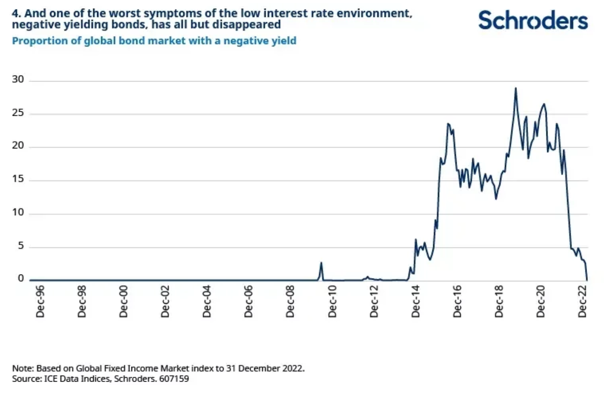
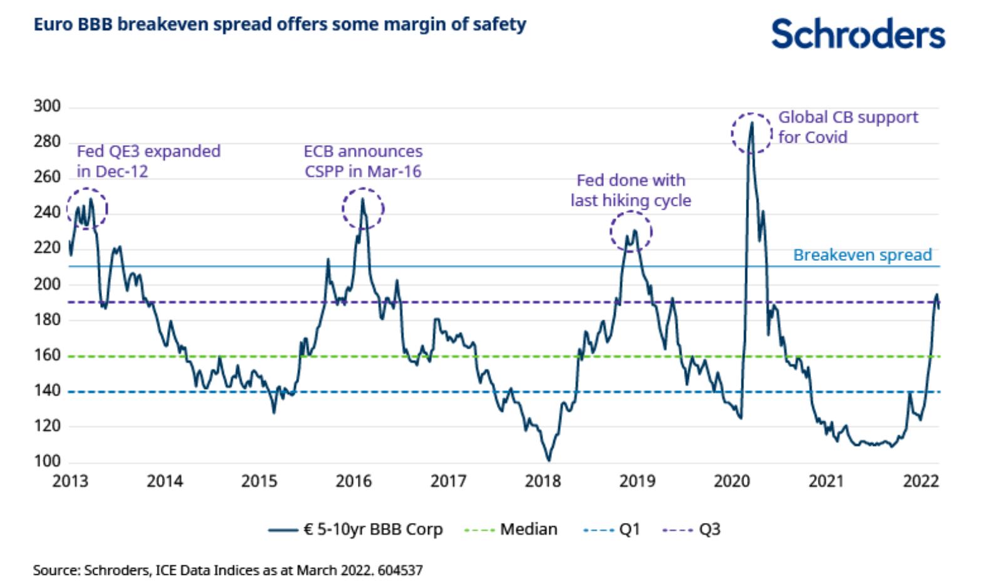

## Data
Corporate bond data are more complex for several reasons: (i) whereas each company has a single stock, a company can have more than 100 bonds outstanding, (ii) the set of outstanding bonds changes over time, and (iii) some bond series are highly illiquid and the raw data have numerous erroneous and real outliers.[(2)](https://papers.ssrn.com/sol3/papers.cfm?abstract_id=4586652) Addressing these data challenges in our project was one of the most challenging tasks. Database file(TRACE.db) and script (.py and .sql) for data-cleaning does not reflect full journey to clean data. There were more hidden cleaning and explatorary data analysis works in this project. 

The period of data used in our project range from 2013 to 2023 (10 years). Unlike other empirical research which incorporate as much data period as possble, our project include recent 10 years data since it captures unique era called negative yield and correspoding dramatic movement of bond market. Below image from Schroder Asset Management report shows that our project period captures unique begin-end of zero interest rate and volatile credit market regime.

For bond price data, our project used Trade Reporting and Compliance Engine (TRACE) database from WRDS. TRACE is a database managed by the Financial Industry Regulatory Authority (FINRA), a non-governmental organization that acts under the supervision of the Securities and Exchange Commission (SEC). TRACE was established to enhance market transparency by facilitating the mandatory reporting of over-the-counter (OTC) transactions in publicly traded U.S. corporate bonds, including debt securities issued by corporations and federal government agencies.

## TRACE Database by SEC
TRACE captures a comprehensive set of information regarding each bond transaction, including the bond's unique identifier (CUSIP), the transaction date and time, the price at which the bond was traded, and the transaction volume (i.e., the amount of the bond that was traded). This data provides a detailed and precise view of the secondary market activity for corporate bonds.

One of the unique aspects of TRACE is its ability to provide real-time, transaction-level price information. Prior to the implementation of TRACE, the bond market was considerably less transparent, with investors often struggling to find accurate pricing data. By making this information available, TRACE significantly enhances market transparency, allowing investors to make more informed decisions.

As mentioned, TRACE is managed by FINRA, which ensures compliance with its reporting requirements and oversees the dissemination of transaction data to promote fair and efficient markets. The primary users of TRACE data are institutional and retail investors, financial analysts, and researchers. These stakeholders use the data to assess current market conditions, perform historical analysis, and inform investment strategies. Our project used this database as researcher.

Despite its significant contributions to market transparency, TRACE has some limitations. First, while it covers a broad range of bond transactions, it does not include all types of fixed-income securities; for example, transactions involving municipal bonds and certain agency securities are not reported through TRACE. Additionally, there can be a delay in the reporting of block trades (large transactions), which might temporarily skew the perceived market activity or pricing. Lastly, the depth of data provided, while extensive, may still lack some granular details that could be pertinent for high-level analysis, such as the identity of the bond buyer or seller.

## Data Cleaning matters
Although TRACE database is one of the most powerful and shows high level of integrity for empirical research, this database does not integrity of analysis. This limitation is not specific limitation for our project only. Question about replicability of The Corporate Bond Factor Zoo project [(1)](https://papers.ssrn.com/sol3/papers.cfm?abstract_id=4589786) has been arose by AQR's research team [(2)](https://papers.ssrn.com/sol3/papers.cfm?abstract_id=4586652). However the author of The Corporate Bond Factor Zoo project initially claimed replication failure of cross-sectional corporate bond risk premium analysis as well [(8)](https://www.sciencedirect.com/science/article/pii/S0304405X18302095). Also, The Corporate Bond Factor Zoo project ICE datasets, while AQR project uses TRACE database. Based on this, our project claim that we cannot guarantee clear robust benchmark and replicability for this project. Rather we decided to derive implication from recent market data and build optimal strategy.
  
To enhance the reliability of our analysis on the corporate bond market, we apply stringent data cleaning rules to the transaction records obtained from the TRACE database. Specifically, we exclude bonds not publicly traded in the U.S. market, such as those issued via private placements, under Rule 144A, non-USD denominated bonds, and bonds issued by non-U.S. entities. We also remove structured notes, mortgage-backed or asset-backed securities, agency-backed securities, equity-linked, and convertible bonds. Additionally, we exclude bonds with floating coupon rates and those with less than one year until maturity. To ensure the robustness of our results, we replicate our analyses using the TRACE dataset curated by the Wharton Research Data Services (WRDS) data science team.

We observe that monthly prices in the TRACE database are recorded precisely at the end of each month, ensuring that monthly returns calculations consistently use month-end prices. This consistency is crucial when employing equity characteristics to compute bond factor returns. However, certain bonds may not have transactions recorded at these specific times, potentially leading to inaccuracies in empirical research. To address this, we employ interpolation techniques for missing data or for months with no trade activity, thus maintaining the continuity and accuracy of our return calculations.

In our study, we also encounter issues related to the discontinuity of operations by some companies, as evidenced by breaks in their unique identification codes. It is a well-established fact that stock tickers alone cannot reliably indicate continuity due to various corporate events such as mergers and acquisitions (M&A), or bankruptcy. To navigate these challenges, we utilize a Mapping Table from WRDS, which helps in tracking changes in company identifiers—CUSIPs, GVKEYs, and tickers—throughout different corporate events. The CUSIP is a nine-character alphanumeric code that uniquely identifies a North American financial security. The GVKEY is a unique identifier used by the Global Vantage database for individual companies, and a ticker is a stock's unique alphabetic name used on an exchange.

If tracking the historical lineage of a bond or issuer proves untenable, we opt to exclude such data from our research. This approach helps minimize the impact of data discontinuities on our analysis, ensuring the integrity and reliability of our empirical findings. This meticulous data management strategy underscores the importance of rigorous data verification in conducting robust financial research.

## Clean Price vs Drity Price
In the TRACE database, the prices recorded for bond transactions are presented as clean prices, which represent the value of the bonds excluding any accrued interest. This format, while standardized, does not reflect the total cost or value of a bond at the point of transaction. For comprehensive analysis, especially when calculating total returns on bonds, it is crucial to consider the dirty price, which includes accrued interest. Accrued interest is the interest that has accumulated on the bond since the last interest payment up to the point of sale, and it directly affects the buyer's actual investment cost and subsequent yield.

To address this discrepancy and enable a more accurate assessment of bond returns, we convert the clean prices from the TRACE database to dirty prices as part of our data processing. This conversion involves adding the accrued interest to the clean price of each bond for the respective transaction dates. By incorporating accrued interest, we ensure that our analysis reflects the total return perspective, providing a more realistic view of the bond's performance and its impact on investment strategies. This adjustment is vital for investors and analysts who rely on precise data to make informed decisions in the bond market.

## Multi Factor Coefficient fitting

### Coefficient data from The Corporate bond Factor Zoo
The Mergent Fixed Income Securities Database (FISD) is a critical resource in the field of financial research, providing extensive data on publicly offered U.S. bonds. Managed by WRDS, FISD includes detailed information on various aspects of fixed-income securities, making it an invaluable tool for studying market trends, deal structures, issuer capital structures, and other relevant topics in fixed-income debt.

In our project, you noted that FISD was used as a primary data source in significant prior research, providing a comprehensive set of bond characteristics and historical data. However, due to the unavailability of FISD for your research, we opted to replicate the procedures using alternative datasets (TRACE). This approach involved rigorous data cleaning and validation to ensure the integrity and comparability of our findings with those derived from FISD data.

Our methodology reflects a careful adaptation to the constraints posed by data access, highlighting the challenges and solutions in conducting empirical research in finance without access to specific databases like FISD. By utilizing other reliable sources and ensuring thorough data processing, we maintain the academic rigor and relevance of our analysis, demonstrating adaptability and resourcefulness in empirical financial research.

Here’s a summary of how The corporate bond factor zoo team(Dickerson, Alexander and Julliard, Christian and Mueller, Philippe) handled their data.

1. Exclusion of Non-Public U.S. Market Bonds: The researchers removed bonds that were not publicly traded in the U.S. market. This category included bonds issued through private placements, bonds issued under Rule 144A, bonds that were not traded in USD, and bonds from issuers not based in the U.S.
2. Removal of Specific Bond Types: They excluded bonds that were classified as structured notes, mortgage-backed or asset-backed securities, agency-backed securities, equity-linked, and convertible bonds.
3. Exclusion Based on Coupon Type: They eliminated bonds that had a floating coupon rate from their analysis
4. Maturity Considerations: Bonds with less than one year remaining until maturity were excluded from the dataset.
5. Replication for Robustness: For robustness checks, they replicated their main results using the TRACE data processed by the WRDS data science team, ensuring that their findings were consistent across different data sets.

These steps ensured that the data used in their study were highly relevant for assessing corporate bond market trends and minimized potential biases introduced by bonds that did not meet specific market and financial criteria.

### Coefficient data from AQR
This paper pointed out replication failure of The Corporate Bond Factor Zoo. In the research paper examining corporate bond factors, AQR team undertake a meticulous and comprehensive approach to data handling, which is crucial for the robustness and credibility of their findings. This outlines the key aspects of the data utilized in their study, emphasizing their methodical approach to data cleaning, integration, and analysis.

1. Data Sources and Integration
The primary data source for the study is the Trade Reporting and Compliance Engine (TRACE), which provides extensive transaction details for U.S. corporate bonds. However, recognizing the limitations and common errors within TRACE, the researchers supplement this with data from the Mergent Fixed Income Securities Database (FISD). This integration allows for a more comprehensive dataset by combining TRACE’s transactional data with FISD’s detailed bond issuance information, thereby enriching the dataset with additional bond characteristics that are not typically available in TRACE.

2. Error Identification and Cleaning Process
Initial data cleaning involves applying standard filters to remove obvious errors and anomalies from the TRACE data. This step is critical as it eliminates straightforward inaccuracies that could potentially skew the analysis. Following this, the researchers conduct a rigorous manual review of remaining outliers. This involves a detailed inspection of extreme values to determine whether they reflect true market events or are data errors. Such a manual review is essential in a market where transactions can vary widely due to market conditions, issuer events, or recording errors.

3. Handling of Outliers
Instead of employing traditional methods such as winsorizing, which might suppress true market extremes, the researchers opt for a manual approach to handle outliers. Each outlier is individually analyzed to confirm its validity, ensuring that the final dataset reflects accurate market behaviors and not distorted by misreported data. This method is particularly effective in maintaining the integrity of the dataset, as it retains genuine economic events while discarding data errors.

4. Data Integration Techniques
The integration with the Mergent FISD is strategically significant as it validates and complements the transaction data from TRACE. The combined data not only offer a fuller picture of each bond’s characteristics but also ensure that the analyses are based on a robust and error-minimized dataset. This integration is crucial for conducting a reliable empirical analysis, as it helps to cross-verify the information and provides a failsafe against potential biases introduced by relying on a single data source.

5. Scientific and Replicability Focus
A key focus of the research is on the replicability of the findings across different datasets and cleaning methods. The study meticulously tests the robustness of corporate bond factors using the cleaned and integrated dataset, addressing a common critique in financial research regarding the reproducibility of results. This focus is instrumental in confirming the external validity of the research findings and contributes significantly to the literature by identifying which bond factors are genuinely predictive and which are not.

Overall, the data used in this research are handled with an exceptional level of diligence and scientific rigor, setting a high standard for empirical research in corporate bond markets. The approach ensures that the findings are not only robust but also replicable, providing valuable insights into the factors that drive corporate bond returns.

Our project tried to replicate The Corporate Bond Factor Zoo's data cleaning process, considering AQR team's suggestion. Below is resulting regression coeffient table based on above approaches.

### Resulting Coefficients tables
1. Bond Market and Term Structure Factors: Includes the bond market factor and a term structure factor. (table name : coefficient_bond_mkt_term)

2. Bond Factors: Contains factors specific to different bond categories. (table name : coefficient_bond_factors)

3. Firm-Level Bond Factors: Provides factors formed on synthetic firm-level bonds. (table name : coefficient_bond_firm_factors)

4. Equity Signal-Based Bond Factors: Features factors derived from equity signals. (table name : coefficient_equity_signals_all)

5. Clustered Equity Signal-Based Bond Factors:  Includes factors based on clustered equity signals.
equity_signals_cluster.csv

6. The Corporate Bond Factor Zoo coefficient : This is updated coefficient table from zoo project (table name : coefficient_zoo_2024)
