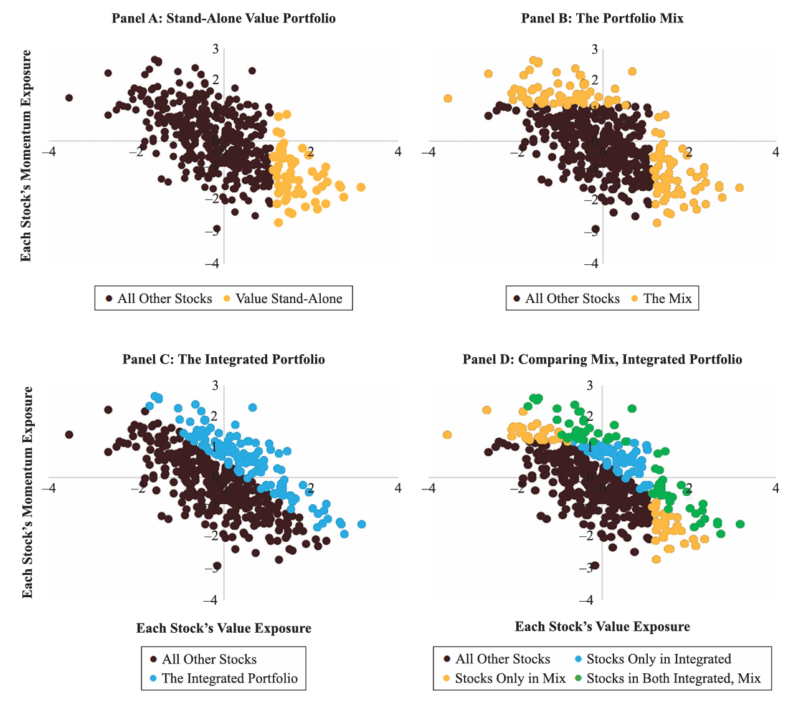
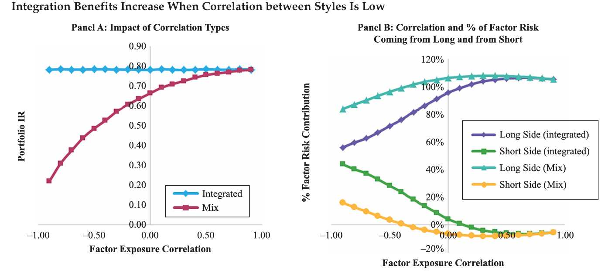
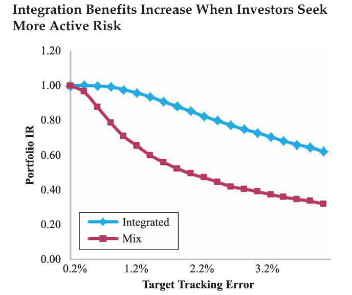
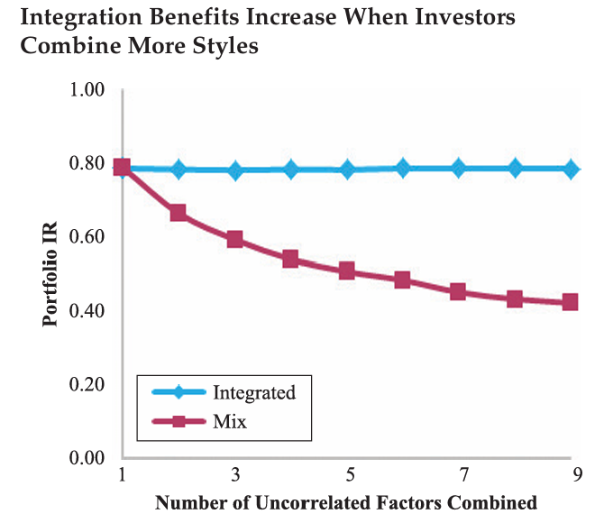

## Long-only multi factor porfolio model
This chapter summarizes the key findings from the academic paper titled "Long-Only Style Investing: Don’t Just Mix, Integrate," which discusses the benefits of integrating multiple investment styles in long-only portfolios as opposed to merely mixing them. This approach aims to enhance portfolio performance by leveraging the interactions between different investment styles. Basic idea for multi factor portfolio is integrating, not mixing. [(4)](https://www.aqr.com/Insights/Research/White-Papers/Long-Only-Style-Investing) 

## Integrated vs Mix factors

### Portfolio Mix
Combines separate long-only portfolios for each style (e.g., value, momentum) without integration:
```math
Portfolio_{mix} = w_{mom} \cdot Portfolio(ER_{mom}, TE_{target}) + (1 - w_{mom}) \cdot Portfolio(ER_{val}, TE_{target})
```
Where:   
$w_{mom}$: Weight assigned to the momentum portfolio.   
$ER_{mom}$ and $ER_{val}$: Expected returns based on momentum and value.   
$TE_{target}$: Target tracking error.    

### Portfolio Integrate
Aggregates information across all styles to form a combined expected return, constructing the portfolio in a single step:
```math
ER_{integrated} = w_{mom} \cdot ER_{mom} + (1 - w_{mom}) \cdot ER_{val}    
```
```math
Portfolio_{integrated} = Portfolio(ER_{integrated}, TE_{target})
```

### Graphic Visualization of integrate vs mix
<div>

</div>


## Practical Implications and Performance Analysis
Empirical results indicate that the integrated portfolio approach outperforms the portfolio mix, providing higher excess returns and better risk-adjusted returns (information ratio):

```math
IR = \frac{Average Excess Return}{Standard Deviation of Excess Return}
```
Integration reduces turnover and associated costs, enhancing trade efficiency across styles.

Integrating investment styles in long-only portfolios offers substantial benefits, including enhanced performance and efficient capital use. This strategy is especially advantageous for managers seeking to maximize exposure to multiple styles without excessive risk or costs. Benefit of portfolio integration follows:
- Integrates complementary characteristics of different styles, improving returns.
- Reduces turnover by effectively netting trades across styles.
- Enhances the ability to manage diversification and risk more effectively
- Empirical evidence proves overperformance compare to portfolio mix

<div>

</div>

<div>


</div>

## Benchmark1 - Mean-Variance Optimized Portfolio

Mean-Variance Optimization (MVO) is a foundational concept in portfolio management. This approach aims to construct portfolios that maximize expected return for a given level of risk or minimize risk for a given level of expected return.

The objective function for a mean-variance optimization problem can be expressed as:

```math
objective function:   
\min_{w} w^T \Sigma w - \lambda w^T \mu

with constraint:  
\w^T * 1 = 1 (sum of weights equals one)   
\w Non-negativity (no short selling included)   
```
where,
```math
\w is the vector of portfolio weights   
\sigma is the covariance matrix of the asset returns   
\mu is the vector of expected asset returns   
\lambda is the risk tolerance factor, balancing between risk and return   
```


## Benchmark2 - Risk Parity
In risk parity, the portfolio is constructed to equalize the risk contribution of each asset, with the aim of achieving diversification and a more stable performance across different market environments. The risk contribution of each asset is proportionate to its weight and its marginal contribution to portfolio risk. The risk parity problem can be expressed as:
```math
\min_{w} \left( \sum_{i=1}^{n} w_i \frac{\partial \sigma_p}{\partial w_i} - \frac{\sigma_p}{n} \right)^2   

with constraint:   
\w^T * 1 = 1 (sum of weights equals one)    
\w Non-negativity (no short selling included)   
```
where,
```math
\w is the vector of portfolio weights   
\sigma_p is the portfolio standard deviation    
\frac{\partial \sigma_p}{\partial w_i} is the marginal contribution of the ith asset to portfolio risk.   
```


