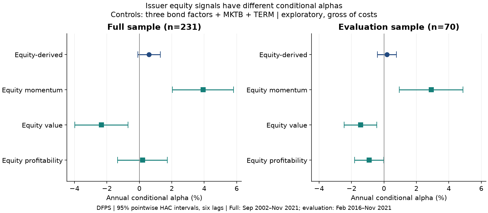
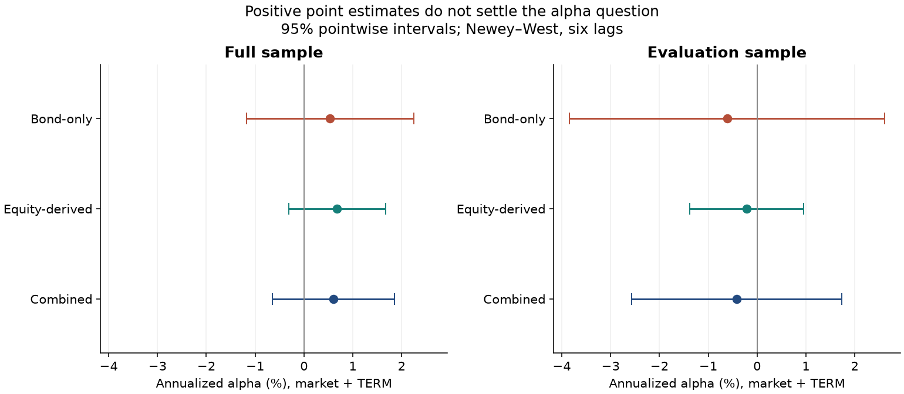

# 4. Evaluation: distinguish signal evidence from an allocation decision

[Portfolio construction](../%28Chapter3%29Porfrolio_model/README.md) · [Next: Applications](../%28Chapter5%29Application/README.md)

## Main result

**The new controls support a narrower allocation conclusion and a sharper follow-up.**
The equity composite has inconclusive alpha after conditioning on individual bond
factors. Its components differ: momentum is positive and value negative. Combining
all six factors has no clear advantage over reducing bond exposure. The following
amendment results are exploratory and use history already inspected in the original
study; the original fixed-combination results are retained below.

## Conditional alpha: what the portfolio average concealed

| Equity-derived target | Full alpha | 95% HAC interval | Full BH q | Later alpha | Later BH q |
|---|---:|---:|---:|---:|---:|
| Equal-weight composite | 0.60% | −0.10% to 1.29% | 0.123 | 0.19% | 0.522 |
| Momentum | 3.93% | 2.04% to 5.81% | 0.00018 | 2.91% | 0.010 |
| Value | −2.33% | −3.97% to −0.69% | 0.011 | −1.44% | 0.010 |
| Profitability | 0.20% | −1.33% to 1.73% | 0.801 | −0.91% | 0.063 |

*DFPS; full sample 231 months, later sample 70 months. Annualized gross intercepts
conditional on credit spread, bond momentum, low volatility, MKTB and TERM. Six-lag
HAC; four-test BH families within each segment. These differ from the market/TERM-only
regressions below. [Exact estimates and bandwidth checks](../research/results/incremental_spanning.csv)*

The new benchmark changes the inference materially: equity momentum's full-sample
q-value is 0.00018 under this model, versus 0.244 under the original market/TERM-only
model and its different testing family. Benchmark choice and the testing family both
matter. A favorable conditional alpha need not imply a positive standalone return or
an executable hedge; coefficients here are estimated contemporaneously in each sample.
This is evidence for a focused follow-up, not permission to select a winning strategy.

Across DFPS, OSBAP and ICE, the composite's full conditional alpha is 0.60%, 0.43% and
0.67%; each six-lag 95% interval includes zero. Momentum is positive and passes the
defined 5% BH threshold in full and later samples across all three. The shared source
inputs and reused history prevent treating this as independent discovery replication.

## A control that reduces bond exposure using prior information

| Period | Strategy | Annual mean | Annual volatility | Sharpe |
|---|---|---:|---:|---:|
| Sep 2007–Nov 2021, 171 months | Combined | −0.12% | 2.69% | −0.044 |
| Same dates | Bond-only | −0.19% | 3.64% | −0.053 |
| Same dates | Risk-scaled bond | −0.21% | 2.76% | −0.076 |
| Feb 2016–Nov 2021, 70 months | Combined | −0.46% | 2.07% | −0.223 |
| Same dates | Bond-only | −0.54% | 3.13% | −0.173 |
| Same dates | Risk-scaled bond | −0.32% | 2.17% | −0.149 |

The control uses only the preceding 60 months to set its exposure. Its average weight
is 0.724 after warmup and 0.693 in the later segment; the cap never binds in DFPS.
Realized risks are close, not identical. All comparison returns use the same dates
and fixed reference notional. [Construction](../%28Chapter3%29Porfrolio_model/README.md)
and [exact performance](../research/results/risk_control_performance.csv).

Combined-minus-control Sharpe is +0.032 after warmup, with a paired six-month-block
95% percentile interval of −0.121 to +0.192. In the later period it is −0.074
(−0.242 to +0.109). Twelve-month-block intervals also include zero. These descriptive
intervals assume useful within-period stationarity and condition on realized paths;
they do not correct for selection or estimate uncertainty in a freshly refitted rule.
[All paired Sharpe intervals](../research/results/sharpe_difference_intervals.csv).

## Incremental cost budget and what the sample can distinguish

| Combined minus risk-scaled bond | Incremental mean | 95% HAC interval | Approx. 80%-power detectable effect |
|---|---:|---:|---:|
| Post-warmup | +9.17 bps/year | −33.65 to +51.98 | 61.20 bps/year |
| Later evaluation | −13.71 bps/year | −51.62 to +24.19 | 54.18 bps/year |

The mean difference is the estimated **additional constant annual cost** the combined
strategy could bear before losing to this control. It is separate from the original
combined strategy's total gross break-even hurdle. Negative headroom is retained,
not reported as zero. Neither turnover nor realized costs are observed.

The amendment sets an illustrative 50-bps/year materiality threshold. The post-warmup
interval includes it, so the result is inconclusive at that threshold. The later
interval's upper bound is below 50 bps, although it still includes zero. Thus the
later data do not support a 50-bps improvement under these assumptions; they do not
prove the strategies equivalent or prove future underperformance. Detectable effects
are normal/HAC precision approximations, not forecast sample-size guarantees.
[Exact cost and precision calculations](../research/results/incremental_cost_budget.csv).

## Paired source comparisons

On the full common sample, DFPS-minus-OSBAP combined mean is −2.85 bps/year
(95% HAC interval −19.16 to +13.46); DFPS-minus-ICE is −7.32 bps (−28.62 to +13.99).
Combined monthly return correlations exceed 0.97 for every pair. These comparisons
provide no clear mean-difference evidence at the chosen precision, but do not establish
database equivalence or certify common construction choices. [Paired results](../research/results/paired_source_differences.csv).

## Original fixed-combination experiment

The fixed combination of bond and equity-derived signals produces a **0.13% annual arithmetic mean** and **0.05 Sharpe** over September 2002–November 2021. Its market-plus-TERM alpha is **0.61% annually**, with p = **0.343** and BH q = **0.685**. The evidence does not establish positive alpha.

All estimates below are **computed in this repository**, using gross long–short factor returns. Published findings are separately attributed in the [source register](../research/SOURCES.md).

## Full sample: 231 months

| Strategy | Annual mean | Annual vol. | Sharpe | Annual alpha¹ | Alpha p | BH q |
|---|---:|---:|---:|---:|---:|---:|
| Bond-only | −0.12% | 3.47% | −0.03 | 0.54% | 0.539 | 0.770 |
| Equity-derived | 0.37% | 2.18% | 0.17 | 0.68% | 0.182 | 0.455 |
| Combined | 0.13% | 2.53% | 0.05 | 0.61% | 0.343 | 0.685 |
| Combined minus bond | 0.24% | 1.40% | 0.17 | 0.07% | 0.825 | 0.888 |

¹ MKTB + TERM regression; six-lag Newey–West covariance. Means and alphas are annualized arithmetically; p- and q-values are two-sided.

The direct improvement in mean return has p = **0.465**. Its annual alpha difference is **0.07%**, with a 95% interval of **−0.55% to +0.69%**. Neither comparison supports a reliable incremental benefit.

### Individual signals

| Signal | Annual mean | Sharpe | Annual alpha¹ | Alpha p | BH q |
|---|---:|---:|---:|---:|---:|
| Credit spread | 9.95% | 0.69 | 4.82% | 0.010 | 0.100 |
| Bond momentum | −1.96% | −0.17 | −0.87% | 0.758 | 0.888 |
| Low volatility | −8.34% | −0.78 | −2.35% | 0.150 | 0.455 |
| Equity momentum | 0.63% | 0.08 | 2.86% | 0.049 | 0.244 |
| Equity value | 0.92% | 0.12 | −0.95% | 0.421 | 0.701 |
| Equity profitability | −0.43% | −0.10 | 0.12% | 0.888 | 0.888 |

Credit spread has positive nominal alpha evidence, but does not pass the stated 5% BH threshold. None of the ten market-plus-TERM alpha tests passes that threshold. The negative low-volatility mean does pass the separate mean-test family; statistical significance need not indicate a profitable hypothesized direction.

## Chronological stability

| Segment | Dates | Months | Bond-only mean | Equity-derived mean | Combined mean |
|---|---|---:|---:|---:|---:|
| Development | Sep 2002–Jan 2016 | 161 | 0.07% | 0.70% | 0.38% |
| Evaluation | Feb 2016–Nov 2021 | 70 | −0.54% | −0.38% | −0.46% |
| Original-period overlap | Jan 2013–Nov 2021 | 107 | 0.42% | 0.20% | 0.31% |

The evaluation segment contains the final 30% of months, rounded upward. Definitions are fixed, but this is not an untouched out-of-sample discovery test: source data were retrospectively revised and the hypotheses came from published research.

The evaluation-period combined Sharpe is **−0.22** and alpha is **−0.41%**, p = **0.707**. The overlapping 2013-period comparison is a sensitivity check, not an independent validation sample.

## Source and methodology sensitivity

| Combined strategy, same dates | Full-sample mean | Full-sample Sharpe | Evaluation mean |
|---|---:|---:|---:|
| DFPS | 0.13% | 0.05 | −0.46% |
| OSBAP | 0.16% | 0.06 | −0.41% |
| ICE | 0.20% | 0.08 | −0.40% |
| ICE, duration-adjusted returns | 0.54% | 0.23 | −0.43% |

The first three hold the selected concepts and weights constant while changing the supplied return file. Their agreement is not three independent experiments: they share signals, issuers, calendar periods, and substantial underlying information. The duration-adjusted line changes the return definition and is not a TRACE duration hedge.

The full-sample combined alpha p-value remains above 0.30 with Newey–West bandwidths of 3, 6, and 12 months. Equal-versus-value-weighted security portfolios and realistic execution delays cannot be reconstructed from these aggregate inputs. Although the older archive contains a turnover file, it pertains to its source portfolios and does not establish turnover for the combined TRACE strategy after netting.

[Source comparisons and estimates](../research/results/performance.csv) · [Duration sensitivity](../research/results/duration_sensitivity.csv) · [Bandwidth sensitivity](../research/results/hac_sensitivity.csv)

## Costs and drawdowns

The combined portfolio's full-sample maximum cumulative P&L decline is **13.77% of fixed long-side notional**; the corresponding bond-only decline is 17.51%. These are not funded-NAV drawdowns.

| Assumed annual cost hurdle | Combined full-sample annual mean after hurdle |
|---|---:|
| 0 bps | 0.13% |
| 100 bps | −0.87% |
| 200 bps | −1.87% |
| 400 bps | −3.87% |

These deductions are **uncalibrated scenarios**, not measured transaction costs. The gross annual mean leaves only about **12.85 bps** before reaching zero; execution delays and borrow fees require separate measurement. [Scenario calculations](../research/results/cost_hurdles.csv)

## Validation and research boundary

The author-table reproduction covers 4,092 statistics. Targeted tests verify economic
signs, missing-factor handling, portfolio arithmetic, initial-loss drawdowns, rank
deficiency, and Newey–West covariance against an independent matrix calculation.
The amendment adds checks for current/future-return leakage, warmup and leverage caps,
monthly alignment, conditional alpha against partial regression, paired block sampling,
and preservation of negative cost headroom. The artifact checker independently
reconstructs primary statistics, conditional alphas, and control weights from the archive.

The analysis does not replicate every published table, prove market efficiency,
estimate causal effects, or reject all equity information in credit. It does not
support a strong investment claim for **this fixed six-signal combination under these
data and definitions**. Positive conditional momentum evidence narrows the next
research question; it does not change the failed allocation case into a successful
strategy. The factor-level diagnostics are complete; execution remains untested.

[Exact outputs](../research/results/) · [Tests](../research/test_study.py) · [Combined notebook](../Combined_README.ipynb)
