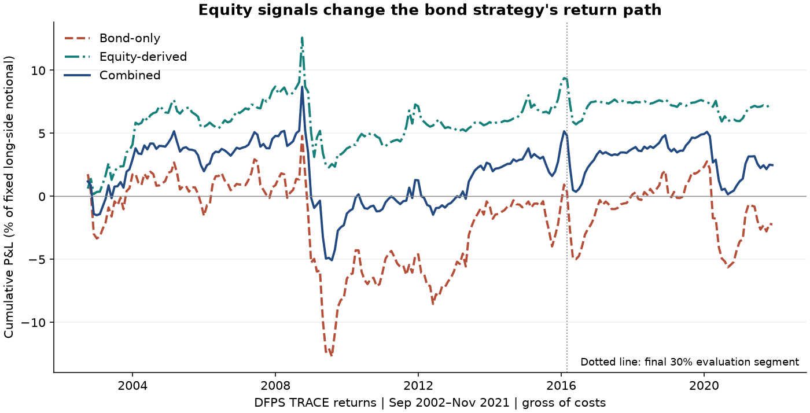

# Corporate Bond Factors: Replication, Equity Signals, and Implementation Risk

**An empirical research study of whether issuer equity signals improve corporate bond factor portfolios.**

I compare bond credit spread, momentum, and low volatility with issuer equity momentum, value, and profitability. The study uses publicly released factor returns, independently reproduces the authors' database comparison, and tests a fixed six-signal extension.

## Findings

The combined strategy does **not** establish reliable incremental alpha. Equity signals reduce volatility in this specification, but the average-return improvement is statistically inconclusive and the later evaluation period is negative.

| Strategy | Annual mean | Annual volatility | Sharpe | Market + TERM alpha | Alpha p-value |
|---|---:|---:|---:|---:|---:|
| Bond-only | −0.12% | 3.47% | −0.03 | 0.54% | 0.539 |
| Equity-derived bond factors | 0.37% | 2.18% | 0.17 | 0.68% | 0.182 |
| Combined, 50/50 | 0.13% | 2.53% | 0.05 | 0.61% | 0.343 |

*Computed here: 231 months, September 2002–November 2021; DFPS TRACE-derived returns; annualized arithmetic means and alphas; six-lag Newey–West inference; gross of costs. These are long–short factor returns per unit of long-side notional, not returns on a funded long-only portfolio. Benchmark and signal provenance are explained in [Data](%28Chapter1%29Data/README.md).*

Three results determine the interpretation:

- **Replication:** all 4,092 statistics in the authors' 341-factor database-comparison table match to numerical precision.
- **Factor direction:** using the source's oriented returns gives the combined portfolio a Sharpe of **0.66**. Restoring the economic directions specified before inspection reduces it to **0.05**. The first number is a diagnostic of orientation choices, not an alternative successful strategy.
- **Later evaluation:** February 2016–November 2021 produces a **−0.46%** annual mean for the combined portfolio. The conclusion is similar under the alternative OSBAP and ICE return files.

## Research contribution

This project demonstrates the research process through inspectable work:

1. **Reproduce before extending.** Reconcile source statistics, dates, units, factor signs, and data vintages.
2. **Connect equity and credit.** Evaluate issuer information through bond portfolios rather than treating equity-factor returns as bond returns.
3. **Test incremental value.** Compare fixed combinations, factor correlations, market and Treasury exposures, uncertainty, and chronological stability.
4. **Interpret implementation limits.** Distinguish gross factor evidence from an executable strategy, including costs, liquidity, shorting, and unavailable holdings.

The original project explored Python/SQL processing of corporate bond data, rolling factor models, and ETF benchmarks. The current study replaces its incomplete empirical narrative with a documented public-data replication and extension. Original scripts remain as historical research; they are not the source of the results above. External researchers receive credit for their datasets, source portfolios, and reused legacy processing code.

## Read the study

| Chapter | Research question |
|---|---|
| [1. Data](%28Chapter1%29Data/README.md) | What exactly is observed, and what does TRACE provenance establish? |
| [2. Factors and evidence](%28Chapter2%29Factor_model/README.md) | Which hypotheses are tested, and what is reproduced? |
| [3. Portfolio construction](%28Chapter3%29Porfrolio_model/README.md) | How do bond-only, equity-derived, and combined strategies differ? |
| [4. Evaluation](%28Chapter4%29Evaluation/README.md) | Do the findings survive inference, later periods, and source changes? |
| [5. Applications](%28Chapter5%29Application/README.md) | What can a credit researcher use, and what remains unproven? |

[Combined research notebook](Combined_README.ipynb) · [Protocol](research/PROTOCOL.md) · [Source register](research/SOURCES.md) · [Exact result tables](research/results/) · [Calculation script](research/run_study.py)

## Reproduce the research

In WSL/Linux with Python 3.12 and uv:

~~~bash
uv sync --locked
uv run python research/download_sources.py
uv run python research/run_study.py
uv run python -m unittest discover -s research -p 'test_*.py' -v
uv run python research/build_notebook.py
~~~

The first download needs internet access. Analysis uses cached archives, checks their recorded SHA-256 hashes, and saves tables and figures under research/results/ and research/figures/. The final command refreshes and executes the combined notebook. A failed download can be restarted; completed archives are reused. Hash mismatches require investigating a changed source release, not silently accepting new data.

The study is a research artifact, with a small environment for regenerating its evidence. It does not require the original private TRACE database. Legacy requirements.txt belongs to the earlier experiments; pyproject.toml and uv.lock govern the current study.

## Interpretation and attribution

The later segment is a chronological diagnostic, **not a pristine out-of-sample discovery test**: signals were known in the literature and historical data had already been revised. The six-signal result does not reject every corporate bond strategy, prove market efficiency, or independently reproduce the authors' underlying transaction cleaning.

Primary sources include [Dick-Nielsen et al., replication framework](https://www.aqr.com/insights/research/working-paper/corporate-bond-factors-replication-failures-and-a-new-framework), [Open Source Bond Asset Pricing data](https://openbondassetpricing.com/machine-learning-data/), and the literature documented in the [source register](research/SOURCES.md). External data retain their own terms; see [data attribution](research/DATA_NOTICE.md).

Research revision: 15 September 2026. Historical data coverage ends in 2021 for the common comparison; this is not a current-market backtest.
