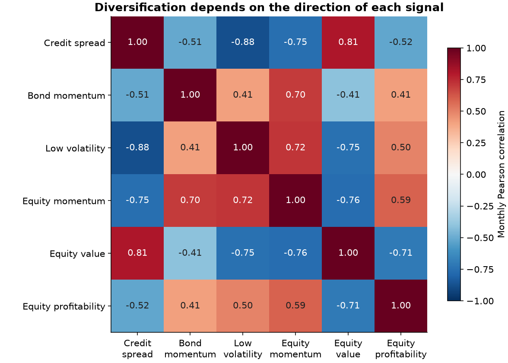

# 3. Portfolio construction: combining bond and issuer information

[Factors](02-factors.md) · [Next: Evaluation](04-evaluation.md)

## The object being traded

Every sleeve is a **corporate bond long–short factor portfolio**. “Equity-derived” means that issuer equity information determines which bonds enter the portfolios. It does not mean buying stocks or averaging stock returns with bond returns.

The underlying author portfolios are monthly, value-weighted extreme-decile sorts. This study combines their published return series. It does not recover security holdings or claim that the resulting trades were executable.

## Fixed weights

Let B contain credit spread, bond momentum, and low volatility, and E contain equity momentum, equity value, and equity profitability. After applying the documented directions:

~~~math
B_t=\frac{f_{spread,t}+f_{bondmom,t}+f_{lowvol,t}}{3},
\qquad
E_t=\frac{f_{eqmom,t}+f_{eqvalue,t}+f_{eqprofit,t}}{3},
~~~

~~~math
C_t=\frac{B_t+E_t}{2},
\qquad
\Delta_t=C_t-B_t=\frac{E_t-B_t}{2}.
~~~

Each signal has a one-sixth weight in the combined strategy. The original strategy
has no estimated expected-return model, optimized allocation, volatility target, or
reweighting based on subsequent returns. The amendment scales a separate comparison
portfolio using prior volatility. Missing signals cause an error rather than a silent
change in portfolio composition.

The contrast Δ directly asks whether the combined portfolio improves average return over the bond-only portfolio. Comparing two Sharpe ratios by inspection does not answer that question statistically.

## Why diversification may help—and why it may disappoint

Credit spread and low volatility have a **−0.88** monthly correlation. Equity momentum and equity value correlate at **−0.76**. These relationships show substantial offsetting exposures.

Equal signal weights therefore do not imply equal risk contributions or six independent sources of alpha. Credit spread has a 9.95% annual mean in the primary sample, but low volatility has −8.34%. Their offset contributes to the bond-only portfolio's small mean. That is a consequence of the fixed hypotheses, not a reason to choose their signs again after observing performance.

The combined portfolio reduces annual volatility from **3.47%** for bond-only to **2.53%**. Its average-return increase is **0.24 percentage points**, with a 95% HAC interval of **−0.41 to +0.90 percentage points**. Diversification is observed; reliable incremental average return is not established.

## New comparison: would reducing bond exposure achieve a similar result?

Lower volatility alone is an incomplete case for adding another signal family.
Construct a control using only the preceding 60 months:

~~~math
w_t=\min\left(1,\max\left(0,\frac{\widehat\sigma(C_{t-60:t-1})}
{\widehat\sigma(B_{t-60:t-1})}\right)\right),
\qquad B^{control}_t=w_tB_t.
~~~

The reference notional is constant; the amount assigned to the bond sleeve varies.
Unused notional contributes zero excess P&L. No cash yield, borrowing or collateral
return is modeled. The cap avoids levered control weights. Forecast volatility ratios
do not ensure equal realized volatility, so both are reported. This control is a
diagnostic for reducing exposure, not a claim of an exactly risk-matched investable fund.

The first 60 months are a warmup for **all** comparisons. The remaining 171 months
start in September 2007; the original later segment remains February 2016–November
2021. Locally generated `research/results/risk_control_returns_*.csv` files
save weights, unclipped ratios and the last training date; the public tree retains
[summary performance](../research/results/risk_control_performance.csv).
Tests change current and
future returns to verify that the current weight cannot change.

Use paired mean differences and paired Sharpe intervals. Bootstrap draws resample
both realized paths together in circular blocks of 6 or 12 months, retaining their
contemporaneous dependence. The 5,000-draw percentile intervals are conditional on
realized weights; they do not refit the rule or account for research selection and
structural breaks. They are descriptive uncertainty checks, not a studentized test.

## Security-level integration remains a different experiment

This completed study tests **mixing existing factor portfolios**. A true integrated strategy would combine characteristics before selecting bonds, allowing overlapping positions to net at the security level.

Lower turnover and better performance from security-level integration are not established here. Testing them requires bond-level identifiers, dated characteristics, holdings, and rebalancing rules. Aggregate factor-return files cannot reveal turnover savings or issuer concentration.

A future security-level comparison should use the same universe and information dates for both constructions, carry signal observations forward only when available, and measure one-month-ahead returns. It should compare issuer-balanced and bond-weighted results and control duration, rating, and liquidity exposures where the data permit.

## Return and capital conventions

The factor return is a long-minus-short spread. Reported annual means equal twelve times the monthly mean. Cumulative charts sum monthly returns on fixed notional; they do not show compound growth of investable wealth.

Drawdown is the decline in cumulative P&L from its running peak, including a zero-P&L starting point, expressed relative to fixed long-side notional. It is not a fund NAV drawdown. A single factor can lose more than 100% of that notional over time because collateral, financing, and liquidation constraints are not modeled.

Fees, bid–ask spreads, borrowing costs, and trade delays are absent. The [evaluation](04-evaluation.md) includes transparent annual cost hurdles rather than an estimated net backtest.

[Strategy summary statistics](../research/results/performance.csv) · [Construction and estimation code](../research/run_study.py)
